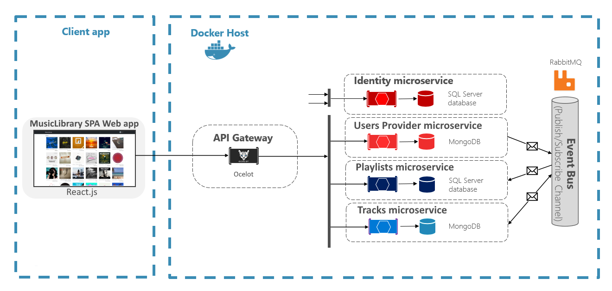

# MusicLibrary

This is a WIP project for educational purposes, where I'm attempting to develop a music library (hence the name) using microservice approach.

# Project's Structure

This project is made up from several microservices and projects.

- [Identity microservice](#identity-microservice)
- [User Provider microservice](#user-provider-microservice)
- [Playlists microservice](#playlists-microservice)
- [Tracks microservice](#tracks-microservice)
- [Api Gateway](#api-gateway)
- [React.js Client SPA Web app](#client-app)
- [Common project](#common-project)
- [Contracts project](#contracts-project)

The general structure and inner workings of the system can seen in the image below.



All the backend components of the system are hosted on Docker, and are reachable through the Api Gateway, with the exception of the Identity microservice.

### A note on IdentityService

The Client app accesses the data through the Api Gateway, however, in order to authenticate the users and to get access to JWT tokens for authorization, the client app is able to directly interact with the Identity service, from outside the Docker host.

### RabbitMQ

In order to share data among microservices (like what tracks were created, or what users have registered), RabbitMQ is used to enable asynchronous communication, and to ensure eventual consistency of data among the microservices.

---

## Identity microservice

This microservice uses IdentityServer4 to provide user authentication and JWT token generation for api authorization.

Further information [here](IdentityService/README.md).

## User Provider microservice

This microservice's purpose is to manage users, and to share user data with other microservices. Currently, it uses it's own database, but in the future it would be preferable to share the same database with the Identity microservice, or to share data with it through RabbitMQ.

Further information [here](UserProvider/README.md).

## Playlists microservice

This microservice provides data about user created playlists.

Further information [here](PlaylistService/README.md).

## Tracks microservice

This microservice manages track related data.

Further information [here](TrackService/README.md)

## Api Gateway

The Api Gateway uses Ocelot to manage api requests to other microservices.

Further information [here](ApiGateway/README.md).

## Client app

The Client app is developed using React.js.

Further information [here](frontend/README.md).

## Common project

This project holds common logic that is shared between multiple projects, such as MongoDB and RabbitMQ setup.

Further information [here](Common/README.md).

## Contracts project

This projects contains the contracts that the microservices use to communicate through RabbitMQ.

Further information [here](Contracts/README.md)

# Building the project

## Launching the back-end

The components of the back-end part can be launched from the root of the project on command line with

```
# Build
docker-compose build
# Run
docker-compose up
```

However some microservices depend on custom NuGet packages ([Common](/Common/) and [Contracts](/Contracts/)) that need to be packed and referenced, in order for the microservices to be able t run. In the future those packages need to be hosted on web, but for now they need to be manually referenced.

## Launching the Client App

The client app needs to be launched with the `npm start` command from the [frontend](/frontend/) folder.

For further information refer [here](frontend/README.md).
